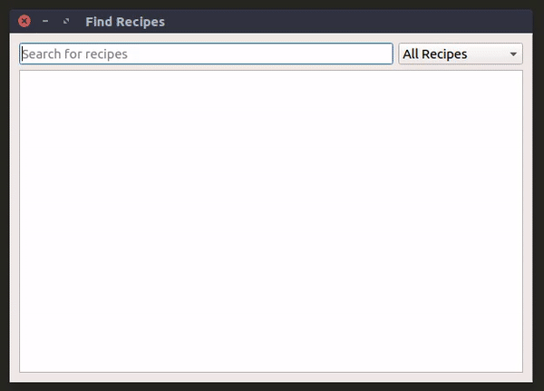

# RecipeFinder
Search Recipe Folder.

The are a number of aims of this project.  
* Get some familiarity of GUI programming in C++, so I'm using Qt.  
* Implement a search-as-you-type functionality.   
* Use fuzzy searching to avoid having to have the exact name of the recipe I'm looking for.  

The fuzzy search is implemented using ```lib_fts``` from [forrestthewoods](https://github.com/forrestthewoods/lib_fts) on Github.

### Installation
1. Download the latest version from the [releases](https://github.com/strangetom/RecipeFinder/releases) page
2. Mark as executable ```chmod +x RecipeFinder```
3. Run

Note that the program requires Qt 5.8 to run. 
This program also assumes the following folder structure:
```
.
RecipeFinder
├── Beef/
├── Chicken/
├── Dessert/
├── Images/
├── Lamb/
├── Pork/
├── Seafood/
└── Veggie/
```
The ```Images/``` folder must exist. The recipes reside in the other folders as \*.md files. These folder names can change.

### Demo



### Things to look at in the future
* Move recipes to a database with fields for title, file location, image location. This is because displaying all the recipes is starting to slow down.