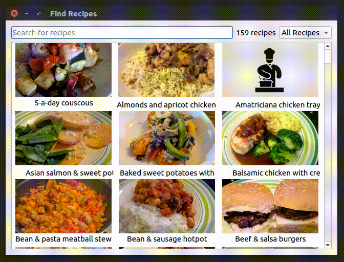

# RecipeFinder
Search Recipe Folder.

The are a number of aims of this project.  
* Get some familiarity of GUI programming in C++, so I'm using Qt.  
* Implement a search-as-you-type functionality.   
* Use fuzzy searching to avoid having to have the exact name of the recipe I'm looking for.  
* Gain familiarity with using databases to store and retrieve information.

The fuzzy search is implemented using ```lib_fts``` from [forrestthewoods](https://github.com/forrestthewoods/lib_fts) on Github.
The json parsing is implemeted using ```json.hpp``` from [nlohmann](https://github.com/nlohmann/json) on Github.

### Demo




### Installation
1. Download the latest version from the [releases](https://github.com/strangetom/RecipeFinder/releases) page
2. Mark as executable ```chmod +x RecipeFinder```
3. On first run, the database will need creating. From the Options menu, choose _update database_.

Note that the program requires Qt 5.9 to run. 
This program also assumes the following folder structure:
```
.
RecipeFinder
recipes.db
├── json/
├── html/
├── Images/
```
The ```images/``` folder must exist. 
The json and html files must have the same names. The json is used to populate the database and the html is used to display the recipes when they are selected.  

## Recipe format
The recipes are stored as json files in the json folder. The json has the following structure
```json
{
  "category":  ,
  "cookTime":  ,
  "description":  ,
  "image":  ,
  "ingredients": [
    "..."
  ],
  "instructions": [
    "..."
  ],
  "name":  ,
  "prepTime":  ,
  "source":  ,
  "totalTime":  ,
  "url":  ,
  "yeild":
}
```
This is loosely based on Google's [recipe markup](https://developers.google.com/search/docs/data-types/recipes).

## To do

-   Give user feedback about database update and clean options.